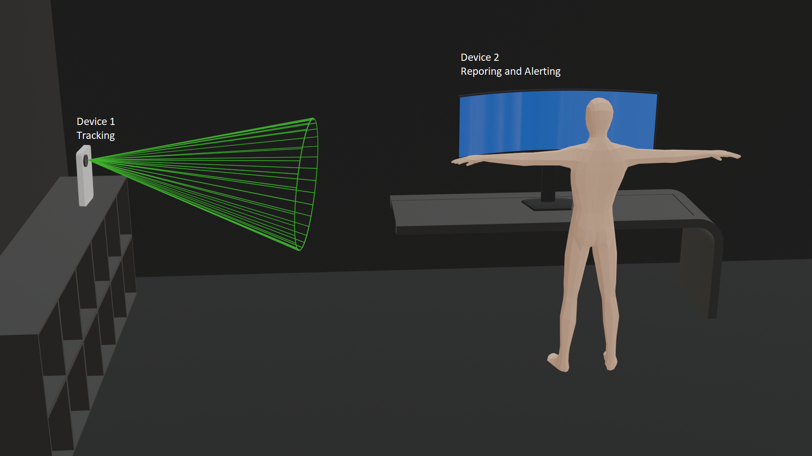

# PostureTracker

Capture pose data through the webcam with TensorFlow and OpenPose; post it to firestore for later use.

Demo: https://evandaley.github.io/webcam-posture-tracker/

## Next steps
- Now that Google OAuth is working, the next step is to post the skeletal data to an event stream that can be read from other systems (in progress). I'd like to have one device off to the side, publishing the ML output data only (no images), and the device in front of me showing the metrics. 

Longer term goals is to have data consumers for

- for realtime alerts: "your posture is bad now"
- and aggregation: "your posture was bad for ten hours

## How to use it
Live site: https://evandaley.github.io/webcam-posture-tracker/authless

Ideally, just visit the website on your phone or a spare laptop/phone/webcam and have that pointed at you from a distance. 

If the camera is head on, you won't get much data. 


Ideally, you want it from the side and like 8-10 feet away.


Once I get the backend stuff set up (probably next weekend), you'll be able to use multiple devices (1 for tracking, 1 to view metrics or receive alerts).


## Run locally
If you want to run this locally, you can do that with
```
cd pose_tracking_web_app
yarn install
yarn run dev
```

Deploy to github pages with
```
yarn run ship
```

Enjoy!
