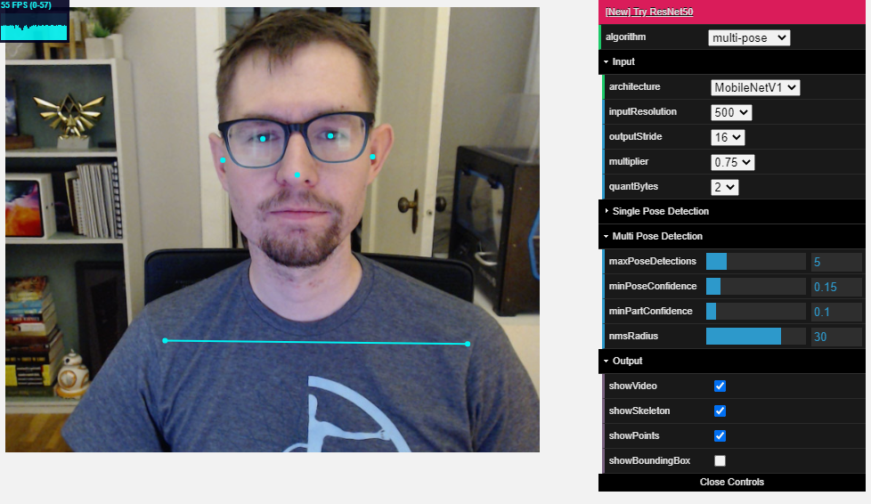
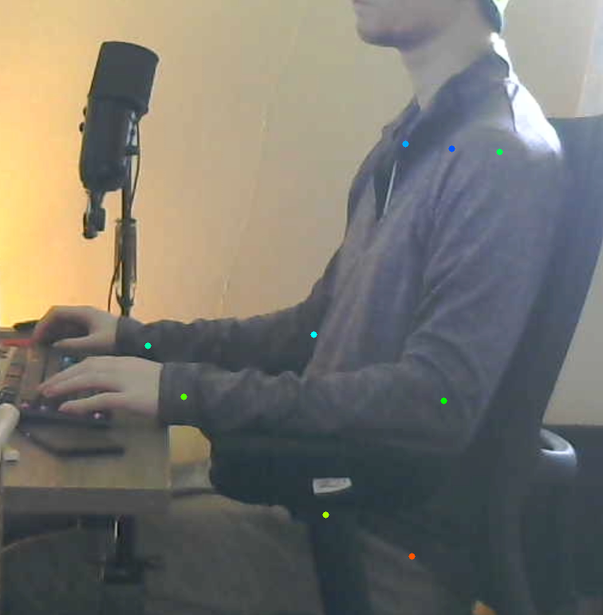

# PostureTracker

Capture pose data through the webcam with TensorFlow and OpenPose.  

Demo: https://evandaley.github.io/webcam-posture-tracker/

## Next steps
- I'd like to add Google Sign-In and post the skeletal data to a firestore database (in progress). 
- Then we can consume that in other future apps for alerting ("your posture is bad now") and reporting ("your posture was bad for ten hours").

## How to use it
Ideally, just visit the website on your phone or a spare laptop and have that pointed at you from a distance. 

Live site: https://evandaley.github.io/webcam-posture-tracker/

If the camera is head on, you won't get much data. 



Ideally, you want it from the side and like 8-10 feet away.


Once I get the alerting/reporting apps up and running, you'll be able to use the `webcam-posture-tracker` app on your phone/whatever and view your live data on a desktop/laptop seperately.


## Run locally
If you want to run this locally, you can do that with
```
cd pose_tracking_web_app
yarn install
yarn run dev
```

Deploy to github pages with
```
yarn run ship
```

Enjoy!
